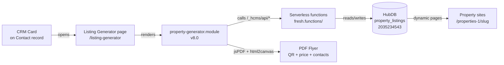

# Property Site Generator — System Guide

**Production account:** Luminate Bank · Portal `242109586` · CLI name `NickMain`
**Source of truth:** this Git repo (`~/Desktop/LuminateSPS`, branch `claude/debug-project-errors-UB8Uq`)
**Current version:** v8.0 (August 2026)

---

## 1. What the system is

A tool that lets Luminate Bank loan officers and partner realtors create single-property
marketing websites and PDF flyers, launched from a card on any Contact record in HubSpot.



## 2. The five components

| Component | Lives in repo at | Deployed to | Deploy command |
|---|---|---|---|
| **CRM Card** (v8.0) | `property-generator-app/` | Developer project `property-generator` (platform 2026.03) | `hs project upload` |
| **Generator module** (v8.0) | `hubspot/modules/property-generator.module/` | Design Manager `modules/property-generator.module` (ID 338897101508) | `hs cms upload hubspot/modules modules` |
| **Property page template** (v8.0) | `hubspot/templates/property-detail.html` | Design Manager `templates/property-detail.html` | `hs cms upload hubspot/templates templates` |
| **API functions** | `hubspot/fresh.functions/` | Design Manager `fresh.functions/` (the ONLY copy with `serverless.json` — it owns the `/_hcms/api/*` routes) | `hs cms upload hubspot/fresh.functions fresh.functions` |
| **HubDB table** | (schema doc: `hubspot/hubdb/README.md`) | `property_listings`, table ID **2035234543** | managed in HubSpot UI |

### Production pages
| Page | ID | URL |
|---|---|---|
| Listing Generator | 382036594403 | `https://242109586.hs-sites-na2.com/listing-generator` |
| Properties (dynamic parent) | 382036737758 | `https://242109586.hs-sites-na2.com/properties-1/<slug>` |

### Configuration that ties it together
- **Secret:** `HUBSPOT_PRIVATE_APP_TOKEN` — the **production** Private App's token, set via `hs secrets`. Functions authenticate to HubDB with it.
- **Table ID:** `hubspot/fresh.functions/serverless.json` → `"HUBDB_TABLE_ID": "2035234543"`
- **Card URL:** `property-generator-app/src/app/cards/PropertyGeneratorCard.jsx` → `generatorUrl` (currently `https://242109586.hs-sites-na2.com/listing-generator`)
- **Website Pages domain:** `242109586.hs-sites-na2.com` (primary since Aug 2026 — `hubspotpagebuilder.net` is prerender-only: query strings 404 and dynamic pages don't resolve there; never switch back)
- **Dynamic page routing:** rows must have the built-in **Page Path** (`hs_path`) set — `createprop.js`/`updateprop.js` write it automatically since v8.0

## 3. How a property gets created

1. User clicks the card on a Contact record → generator opens with `?email=<user>` for identity
2. User fills the form, uploads photos (`uploadfile` endpoint → HubSpot Files)
3. `createprop` writes a HubDB row (values + root-level `path`/`name`), publishes the table
4. The dynamic Properties page instantly serves `/properties-1/<slug>` from that row
5. Flyer button renders the hidden flyer template with property data (client-side), converts to PDF via html2canvas + jsPDF. QR code comes from `api.qrserver.com` and points at the property page

Ownership: users can only edit/delete rows where `created_by_email` matches their email.

## 4. Making updates — the easy way

**The rule that prevents every problem we had:** the repo is the single source of truth,
and each component has exactly ONE deployed location (the table above). Never upload to
any other Design Manager path, never edit files directly in Design Manager.

### Standard flow (~2 minutes)

1. **Tell Claude what to change.** Claude edits the repo, bumps versions, commits, pushes.
2. **On your Mac, run the deploy script:**
   ```bash
   cd ~/Desktop/LuminateSPS
   ./deploy.sh          # deploys everything (safe default)
   # or target one piece:
   ./deploy.sh module     # generator UI changes
   ./deploy.sh template   # property page changes
   ./deploy.sh functions  # API/backend changes
   ./deploy.sh card       # CRM card changes
   ```
   The script pulls from GitHub first, so it always deploys what Claude pushed.
3. **Hard refresh** (Cmd+Shift+R) the generator page / Contact record and confirm the
   version number in the header matches the new version.

### Version bump convention
Every user-visible release bumps the version string in all of:
- `module.js` line 1 + console.log, `module.html` header + feedback email body
- `property-detail.html` template comment + feedback email body
- `PropertyGeneratorCard.jsx` card title
(Claude handles this automatically when asked to bump.)

## 5. Troubleshooting quick table

| Symptom | Likely cause | Check / fix |
|---|---|---|
| Card shows "problem displaying this content" | Card build/SDK issue | `hs project logs --account=NickMain`; confirm `@hubspot/ui-extensions` is `latest` in `src/app/cards/package.json` |
| Generator shows an old version | Browser/CMS cache, or upload went to a wrong path | Hard refresh; confirm upload said `modules/property-generator.module`; check page source for `module_assets/1/338897101508/` |
| Page 404s | Domain or propagation | Confirm Website Pages primary domain is `hs-sites-na2.com`; wait 5 min (404s cache per query string) |
| Property page 404s but row exists | Row missing built-in Page Path | Open the row in HubDB, set Page Path; editing via the generator also repairs it |
| Created property doesn't appear | Functions writing to wrong table or bad token | `hs cms fetch fresh.functions/serverless.json` → check table ID; re-set secret with the production app token |
| Images broken on flyer | Portal-ID'd file URLs | Files must exist in production Files tool; URLs reference portal 242109586 |
| New property data missing contacts | Profile fields skipped at creation | Edit the property, fill realtor/LO sections, save |

## 6. History — why the migration was painful (so nobody repeats it)

The April sandbox→production copy left **four copies** of the module, four templates,
and three function folders in production's Design Manager, and the CRM card kept a
**hardcoded sandbox URL** — so for months, "production" was really the sandbox: sandbox
page, sandbox functions, sandbox token, sandbox HubDB table. Fixes uploaded to
production changed files nothing referenced.

Resolved in Aug 2026 by: pointing the card at the production page, fixing the table ID
and token, making `hs-sites-na2.com` the Website Pages domain, importing the 28 beta
listings from the sandbox table, and deleting every duplicate copy. The guardrails now:
one repo, one deploy script, one canonical path per component.

**The sandbox (portal 244637957) is now out of the loop entirely.** Its table still
holds the pre-migration beta data as a historical backup.

## 7. Open items / future ideas

- **In-CRM modal:** the card currently opens the generator in a new tab. The iframe
  modal needs frame-policy investigation on `hs-sites-na2.com` (or wait for a custom
  domain — see next item).
- **Custom domain:** connecting e.g. `listings.luminatebank.com` for Website Pages
  would give branded property URLs (update `generatorUrl` in the card + QR links follow
  automatically).
- **Platform deprecation watch:** the developer project is on platform 2026.03; HubSpot
  deprecates platform versions roughly yearly — expect a `hs project migrate` eventually.
- **Feedback button** in the generator emails nicholas.sullivan@luminate.bank with
  version + browser info — check it when beta users report issues.
